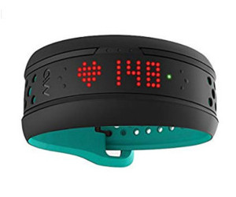
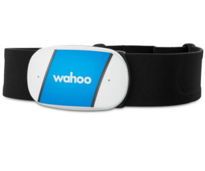
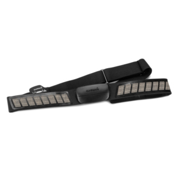
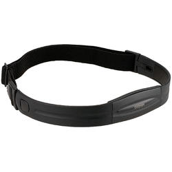
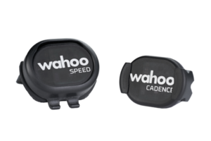
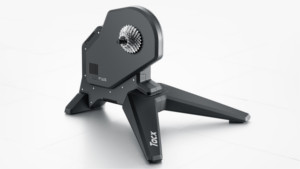
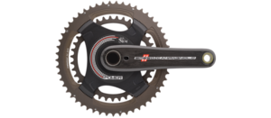

# List of tested sensors in CONAMO

----------------------------------------------------------------

----------------------------------------------------------------

## MIO Fuse

[+Info](https://support.mioglobal.com/hc/en-us/articles/235465827-Getting-Started-with-Mio-FUSE)

## Wahoo HRM

[+Info](https://eu.wahoofitness.com/devices/heart-rate-monitors/wahoo-tickr-heart-rate-strap)

## Garmin Soft Strap

[+Info](https://buy.garmin.com/en-US/US/p/15490)

## Garmin Heart Rate Monitor

[+Info](https://buy.garmin.com/en-US/US/p/10996)

----------------------------------------------------------------
  
----------------------------------------------------------------

## Wahoo RPM Speed and Cadence

[+Info](https://eu.wahoofitness.com/devices/bike-sensors/wahoo-rpm-cadence-sensor)

## Tacx Flux

[+Info](https://tacx.com/product/flux-smart/)

----------------------------------------------------------------
 
----------------------------------------------------------------

## SRM Campagnolo Crank

[+Info](http://www.srm.de/product/powermeters/campagnolo/)

## Tacx Flux

[+Info](https://tacx.com/product/flux-smart/)

